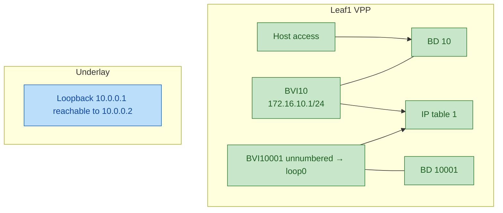
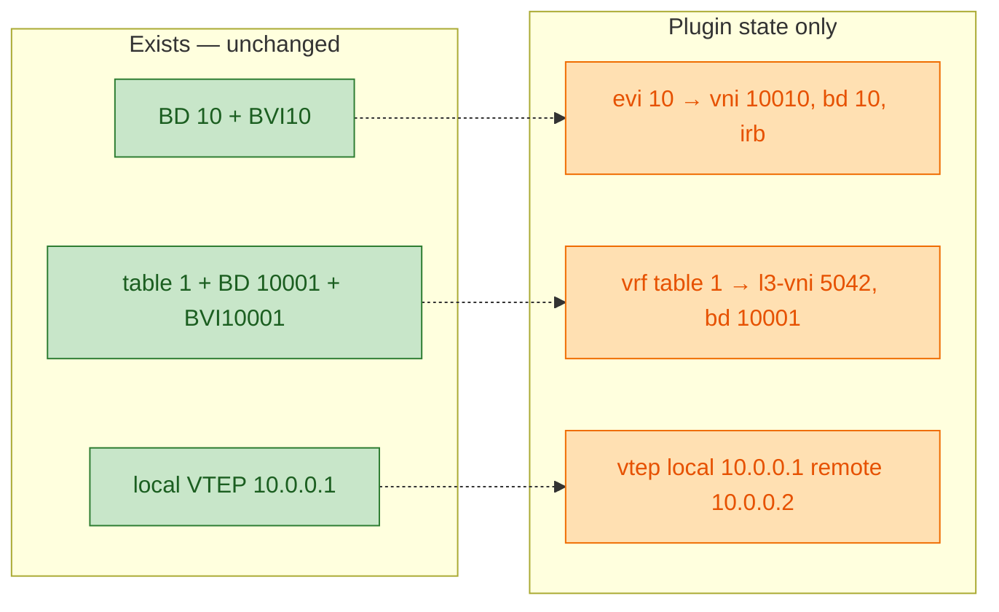
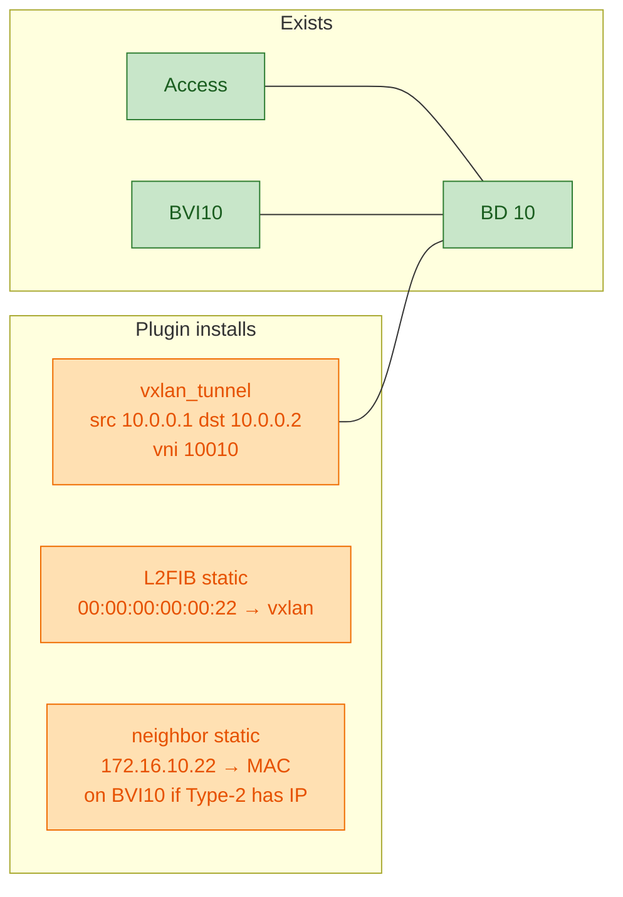
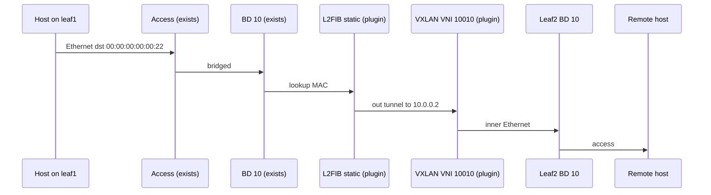
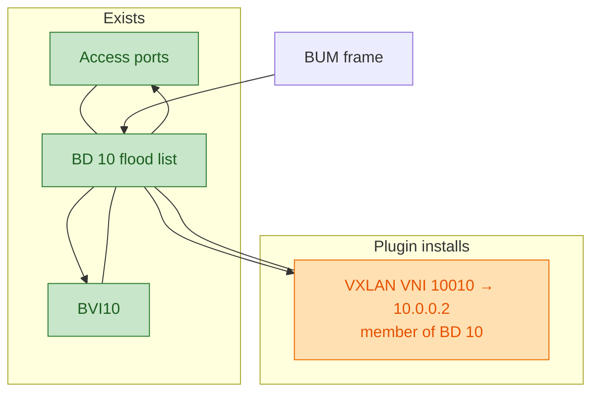
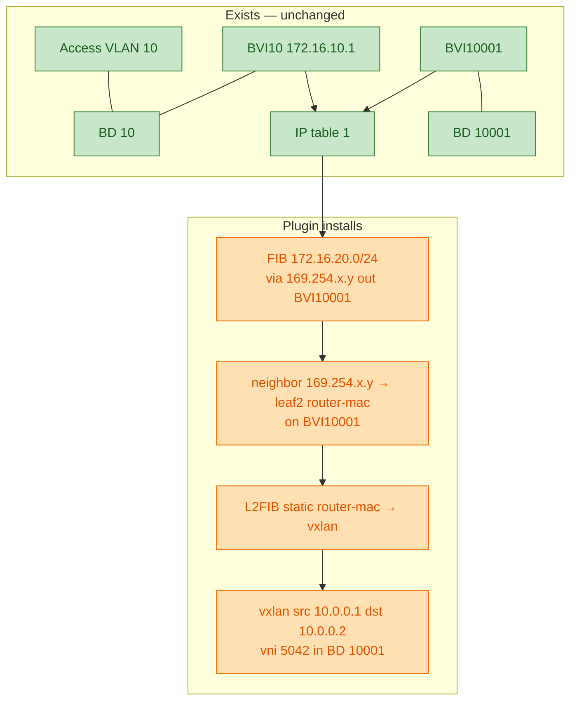
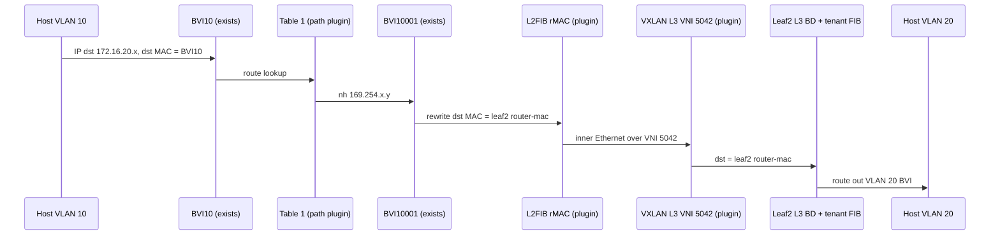
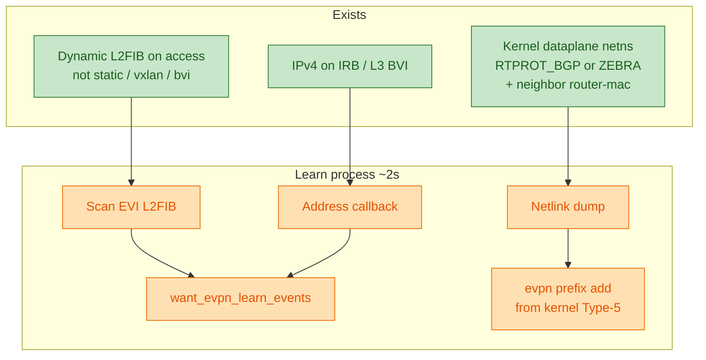

# VPP EVPN plugin (L2 + symmetric IRB)

Out-of-tree VPP plugin that programs **remote EVPN reachability** into VPP
bridge domains, L2FIB, neighbors, and IP FIB. It is an **EVPN-to-FIB/FDB
agent**, not an EVPN speaker.

It does **not** run BGP, originate NLRI on the wire, or terminate VXLAN in a
new graph node. A userspace control plane (FRR, BIRD `vppevpn`, or a custom
agent) translates EVPN Type-2 / Type-3 / Type-5 into the CLI / binary API
below. The plugin then attaches existing VPP objects the way a PE would after
importing those routes.

Version 0.1. Target datapath is **VLAN-based EVPN** with **symmetric IRB**
(RFC 7432 + RFC 9135). Asymmetric IRB, ESI / Type-1 / Type-4, and VLAN-aware
bundle are out of scope.

## Role in the stack

Think of three layers on each leaf:

| Layer | Owner | Responsibility |
| --- | --- | --- |
| Control plane | FRR or BIRD in the dataplane netns | Underlay IGP, BGP EVPN, Type-2/3/5 import/export |
| Provisioning | Lab / NMS / `vppctl` before registration | Bridge domains, BVIs, IP tables, access ports, VLAN subifs, LCP, addresses |
| This plugin | `evpn_plugin.so` | Remote MAC/FDB, IMET flood members, Type-5 prefixes, refcounted VXLAN tunnels |

The plugin never creates Linux interfaces, never configures access VLANs, and
never speaks MP-BGP. If the control plane has not imported a route, the plugin
has nothing to install unless an operator or agent pushes the equivalent CLI.

## What a network engineer should expect

On a typical EVPN PE you would see:

- a **broadcast domain** per EVI (bridge domain = VLAN in this implementation)
- **VXLAN VNIs** for L2 (per-VLAN) and, with symmetric IRB, a **transit L3 VNI**
- **Type-2** remote MAC(/IP) → overlay next hop (remote VTEP)
- **Type-3 IMET** → BUM flood list to remote VTEPs
- **Type-5 IP prefix** → remote PE router MAC over the L3 VNI

This plugin implements that **after** the objects already exist in VPP:

- **L2 EVI** — BD `bd`, one VXLAN tunnel per remote VTEP on that VNI, static
  L2FIB for Type-2, BD membership for Type-3. Optional IRB: existing BVI in
  that BD; Type-2 with IP also installs a static neighbor on the BVI.
- **Symmetric IRB** — tenant IP table plus L3-VNI BD `10000 + table_id` with
  its BVI (router MAC). Type-5 does **not** use VPP `vxlan … l3`. The L3 VNI
  is still an Ethernet VXLAN attached to the L3 BD. The IP FIB points at a
  **synthetic overlay next hop** in `169.254.0.0/16` derived from the remote
  VTEP; ARP/ND of that next hop is the remote PE’s router MAC on the L3 BVI;
  L2FIB of that MAC points at the L3-VNI tunnel.

Same-subnet east-west uses the L2 VNI. Inter-subnet (including hosts on
different VLANs of the same VRF) uses the local IRB BVI, then the L3 VNI to
the remote PE, which routes out its own IRB BVI.

## Ownership model

Registration **binds** to infrastructure. It does not create, reconfigure, or
delete it.

**Provisioning owns** (create these first, keep them stable while registered):

- bridge domains and BVIs
- IPv4/IPv6 tables and BVI table bindings
- BVI MACs and addresses, interface admin state
- access ports, tagged VLAN subinterfaces, LCP peers
- underlay reachability to remote VTEPs

**Plugin owns:**

- EVPN-installed remote MAC entries (static L2FIB)
- Type-5 FIB paths and overlay neighbors
- refcounted VXLAN tunnels `{src, dst, vni}`

Rules:

- `evpn evi add … bd N` requires bridge domain N. `irb` also requires a BVI
  already in that domain; the plugin does not create one. Terminate IRB EVIs
  even on VNIs this leaf only stitches (no local access / SVI) — still create
  the BD and BVI first.
- `evpn vrf add table T …` requires an existing IPv4 and/or IPv6 table T,
  bridge domain `10000 + T`, and its BVI. That BVI must already be bound to T
  for every address family present at registration. Unnumber the L3 BVI to
  the node loopback (`set interface unnumbered bvi{10000+T} use loop0`) so
  IPv4 input is enabled. Traceroute then sources the loopback / VTEP address,
  not a 169.254 on the transit BVI. The Type-5 overlay next hop in
  `169.254.0.0/16` stays internal to the FIB adjacency.
- Optional `router-mac` is an **assertion** against the existing BVI MAC, not
  a request to change it. Missing objects or mismatched bindings/MACs fail
  registration and provision nothing.
- Do **not** also provision static VXLAN tunnels for the same
  local/remote/VNI. The plugin creates those on Type-2 / Type-3 / Type-5
  install and deletes them when the last reference goes away.
- Withdraw MAC and IMET entries before deleting an EVI, and prefixes before
  deleting a VRF. Deletion rejects outstanding children and leaves the BD,
  BVI, addresses, and IP tables intact.
- To change BD, BVI, MAC, or table binding: withdraw remote state, unregister,
  reconfigure provisioning, register again.

### Exists vs what the plugin changes

| Object | After provisioning | `evi` / `vrf` / `vtep` add | Type-2 / Type-3 / Type-5 |
| --- | --- | --- | --- |
| VLAN BD, access ports, L2 tag-rewrite | Exists | Unchanged | Unchanged |
| VLAN BVI, MAC, tenant address, `ip table` bind | Exists | Unchanged (`router-mac` is checked, not set) | Type-2 with IP: **adds** static neighbor on this BVI |
| Tenant IP table | Exists | **Lock** (refcount); table itself unchanged | Type-5: **adds** FIB path |
| L3-VNI BD `10000+table`, L3 BVI unnumbered to loopback | Exists | Unchanged | Type-5: **adds** static L2FIB + overlay neighbor on this BVI |
| VXLAN `{src,dst,vni}` | Must **not** exist for the same triple | Still none | **Creates** (refcount++) ; last withdraw **deletes** |
| Static L2FIB (remote MAC / remote router MAC) | None | None | **Adds** / **deletes** |
| IMET flood member | BD flood = access + BVI only | None | Type-3: **attaches** VXLAN to BD flood list |
| Overlay NH `169.254.x.y` | Not used | None | Type-5: **derived** from remote VTEP; not a real host |
| Underlay (loopback, IGP, encap table) | Exists | `vtep add` records local src / encap table | Tunnels encaps toward that src |

Unregister / `del` of EVI or VRF **never** removes provisioning objects. Child
MAC/IMET/prefix must be withdrawn first; tunnels drop only when refcount hits
zero.

In the diagrams below, green is **already there**, amber is **plugin
install/change**, blue is **underlay**.

## Scenarios

Lab-shaped example (same as `test/smoke.cli`): leaf1 VTEP `10.0.0.1`, leaf2
`10.0.0.2`, VLAN 10 / VNI `10010` / BD 10 / BVI10, tenant table 1, L3 VNI
`5042` / BD 10001 / BVI10001.

### 1. Provisioning only (plugin idle)

No EVPN objects, no VXLAN. East-west to the other leaf is not possible.



**Exists:** BD, BVI, table bind, addresses, access, underlay.  
**Plugin:** nothing.

### 2. Registration (`evi` / `vrf` / `vtep`)

The plugin **binds** to the objects above. Still no overlay tunnels.



**Exists:** same infrastructure.  
**Changes:** plugin hashes (EVI/VRF/VTEP). FIB lock on table 1. If `irb`, a
local MAC learn event for BVI10’s MAC. Optional `router-mac` must **match**
the BVI; mismatch fails and changes nothing.

### 3. L2 known unicast (Type-2)

Remote host MAC `00:00:00:00:00:22` / `172.16.10.22` behind leaf2. Same subnet.





**Exists:** BD 10, access, BVI10 (IRB neighbor target only).  
**Changes:** create/reuse VXLAN, `set interface l2 bridge` tunnel into BD 10,
static L2FIB, optional static neighbor on BVI10. Withdraw reverses those;
BD/BVI stay.

### 4. L2 BUM / IMET (Type-3)

Unknown unicast, broadcast, multicast: ingress replication. No multicast
underlay.



**Exists:** flood list = access + BVI.  
**Changes:** attach the L2 VNI tunnel as a normal BD port (shared with Type-2
to the same VTEP via refcount). Type-3 does **not** add an L2FIB entry.
Withdraw Type-3: tunnel leaves the flood list when refcount hits zero (or
stays if a Type-2 still holds it).

### 5. Symmetric IRB inter-subnet (Type-5)

Host on VLAN 10 (`172.16.10.0/24`) to prefix `172.16.20.0/24` behind leaf2.
Routing is local IRB → L3 VNI → remote IRB. Not asymmetric (no L2 VNI of the
*destination* VLAN on this leaf).





**Exists:** table 1, both BVIs, BD 10 and BD 10001, BVI MACs and addresses.  
**Changes:** L3 VNI VXLAN, static L2FIB for **remote** router MAC, synthetic
NH + neighbor, FIB path. Inner frame is Ethernet (not VPP `vxlan … l3`).
Withdraw prefix: delete FIB path, overlay neighbor, L2FIB, release tunnel.
L3 BD/BVI and the loopback it is unnumbered to remain.

Same-subnet traffic in an IRB EVI still follows scenario 3 (L2 VNI), not the
L3 VNI.

### 6. Local learn and kernel Type-5



**Exists:** access-learned MACs, BVI addresses, FRR/zebra routes and
neighbors in netns `dataplane`.  
**Changes:** binary-API learn events for a BGP agent; kernel Type-5 is
**installed into VPP** the same as scenario 5. Skips via=local VTEP and
`169.254.0.0/16`. Stale kernel-sourced prefixes are withdrawn. The plugin
still does not speak BGP.

## EVPN route → VPP objects

| EVPN | CLI | Dataplane effect |
| --- | --- | --- |
| Local EVI / VNI bind | `evpn evi add evi <id> vni <n> bd <id> [irb]` | Remember BD (+ BVI if `irb`). No tunnel yet. IRB also originates a local MAC learn event for the BVI MAC. |
| Local VRF / L3 VNI bind | `evpn vrf add table <id> l3-vni <n>` | Remember table, BD `10000+id`, L3 BVI. Locks the IP table(s). |
| Underlay VTEP pair | `evpn vtep add local <ip> remote <ip> [encap-table <id>]` | Local src/encap VRF used when building tunnels. First add becomes the **default local VTEP**. |
| Type-2 MAC(/IP) | `evpn mac add evi <id> mac <mac> [ip <addr>] remote <vtep>` | Acquire VXLAN `{local, remote, evi.vni}`, `set interface l2 bridge` into the EVI BD, static L2FIB `mac → tunnel`. If `ip` and IRB: static neighbor `ip → mac` on the EVI BVI. |
| Type-3 IMET | `evpn imet add evi <id> remote <vtep>` | Same tunnel acquire + BD attach so the tunnel is on the **flood list** (BUM). No L2FIB entry by itself. |
| Type-5 prefix | `evpn prefix add table <id> <pfx> remote <vtep> router-mac <mac>` | Acquire VXLAN `{local, remote, l3-vni}`, attach to L3 BD, static L2FIB `router-mac → tunnel`, FIB `pfx via 169.254.x.y` out the L3 BVI, static neighbor `169.254.x.y → router-mac` on that BVI. |

Matching `… del …` reverses the install and releases the tunnel reference.

**Tunnel identity** is `{src, dst, vni}` with a refcount. MAC + IMET on the
same EVI to the same VTEP share one L2 VNI tunnel. Prefixes to that VTEP use
the L3 VNI tunnel. Instances start at `vxlan_tunnel1000` so the agent can
resolve the interface by name (the VXLAN plugin does not export its C create
API).

**Local VTEP resolution:** Type-2/3/5 look up `evpn vtep` by remote address.
If none matches, the first configured local VTEP of the same address family
is used. Configure VTEPs before installing remote state.

**Type-5 overlay next hop:** `169.254.x.y` is hashed from the remote VTEP
(host byte avoided `.0` / `.255`). It exists only to complete an Ethernet
adjacency on the L3 BVI; it is not a numbered address on that BVI and is not
advertised as a tenant prefix. ICMP time-exceeded uses the loopback the L3
BVI is unnumbered to. Re-adding the same prefix/VTEP/router-MAC is idempotent
and refreshes the neighbor so the FIB adjacency does not stay incomplete.

## Packet walk

**Same EVI (Type-2 known unicast)**  
Access port → BD → static L2FIB → VXLAN L2 VNI → remote VTEP → remote BD →
host. Unknown unicast / BUM uses BD flood, which includes IMET-attached
tunnels (ingress replication; no multicast underlay).

**IRB, same subnet, remote MAC**  
Host ARPs the destination; the remote Type-2 may already have installed
`ip → mac` on the local BVI and `mac → L2 VNI tunnel` in L2FIB. Bridging
stays in the L2 VNI.

**IRB, different subnet (symmetric)**  
Host ARPs the local IRB (BVI in the VLAN BD). VPP routes in the tenant table
to `169.254.x.y` out the **L3 BVI**. That IP is the remote PE router MAC.
L2FIB in BD `10000+table` sends that MAC into the L3 VNI VXLAN. The remote
PE receives inner Ethernet destined to its router MAC, routes in its tenant
table, and exits the destination VLAN BVI.

## Learn / origination

`evpn learn enable` starts a 2-second scan. It does **not** run BGP. It
originates local events for a control-plane agent and, for Type-5, can
consume what FRR/zebra already installed in the kernel.

1. **Local Type-2 candidates** — dump L2FIB on each registered EVI BD.
   Advertise dynamic MACs that are not static, not on a `vxlan*` port, and
   not on a `bvi*` port (access-learned hosts).
2. **Local Type-5 candidates** — IPv4 address callbacks on IRB / L3 BVIs
   publish connected prefixes with the BVI router MAC.
3. **Remote Type-5 from kernel** — netlink dump in netns `dataplane`
   (`/run/netns/dataplane` or `/var/run/netns/dataplane`; otherwise the
   process netns). Unicast IPv4 routes with `RTPROT_BGP` / `RTPROT_ZEBRA`,
   whose table id matches a registered VRF, whose gateway is **not** the
   local VTEP, and whose gateway has a kernel neighbor (router MAC), are
   installed with `evpn prefix add`. Prefixes in `169.254.0.0/16` are
   skipped. Kernel-sourced prefixes not seen in the latest dump are
   withdrawn.

Events go to binary-API clients that registered `want_evpn_learn_events`
(`evpn_mac_learn_event` / `evpn_prefix_learn_event`). linux-cp does not
mirror VRF / VXLAN / L3-VNI objects into that netns; FRR still places
imported Type-5 and router-MAC neighbors there, which is why the plugin
reads the kernel instead of the VPP FIB for remote prefixes.

## CLI

```
evpn evi add evi <id> vni <n> bd <id> [irb] [router-mac <mac>]
evpn vrf add table <id> l3-vni <n> [router-mac <mac>]
evpn vtep add local <ip> remote <ip> [encap-table <id>]
evpn mac add evi <id> mac <mac> [ip <addr>] remote <vtep>
evpn imet add evi <id> remote <vtep>
evpn prefix add table <id> <prefix>/<len> remote <vtep> router-mac <mac>
evpn learn enable|disable
evpn logging [level <emerg|alert|crit|error|warn|notice|info|debug|disabled>] [syslog-level <level>]
show evpn [evi|vrf|mac|prefix|tunnel|imet|vtep]
```

Matching `… del …` forms remove state.

Suggested bring-up order on a leaf:

1. Underlay (loopback VTEP, IGP).
2. Tenant IP table, VLAN BDs + BVIs + addresses, L3-VNI BD `10000+table` + BVI unnumbered to the loopback.
3. Access / VLAN membership.
4. `evpn evi add` / `evpn vrf add` / `evpn vtep add`.
5. Control plane (or smoke CLI) for IMET, MAC, prefix.
6. `evpn learn enable` if the agent should originate and pull kernel Type-5.

### Verification

```
show evpn
show evpn evi
show evpn vrf
show evpn mac
show evpn imet
show evpn prefix
show evpn tunnel
show evpn vtep
show bridge-domain
show l2fib verbose
show ip fib table <id>
show ip neighbors
show vxlan tunnel
```

Expect: L2 VNI tunnels in the VLAN BD; L3 VNI tunnels in BD `10000+table`;
static L2FIB for remote MACs / remote router MACs; tenant prefixes via
`169.254.x.y` with a neighbor on the L3 BVI.

## Logging

Class `evpn`. CRUD and learn at `debug`; missing objects at `warn`; tunnel /
VTEP failures at `error`. Default class level follows VPP (`notice`), so
debug is silent until raised:

```
evpn logging level debug
# equivalent:
set logging class evpn level debug
show logging
show evpn
```

## Layout

```
vpp-evpn-plugin/
  Dockerfile               # multi-stage: build .so + runtime VPP image
  CMakeLists.txt
  README.md
  evpn.h / evpn.c          # object pools + tunnel refcount
  evpn_cli.c               # debug CLI
  evpn.api / evpn_api.c    # binary API + learn events
  evpn_learn.c             # L2FIB scan + address callbacks + kernel Type-5
  evpn_plugin.c            # VLIB_PLUGIN_REGISTER
  test/smoke.cli           # example two-leaf L2 + IRB sequence
```

## Build

### Docker (recommended)

From this directory:

```bash
docker build -t ghcr.io/exergy-connect/vpp-with-evpn-plugin .
# Pin FD.io version (same style as the lab image):
docker build -t ghcr.io/exergy-connect/vpp-with-evpn-plugin \
  --build-arg VPP_VERSION=25.06-release .
```

CI (`.github/workflows/docker.yml`) builds on `main` / `v*` tags and pushes
`ghcr.io/exergy-connect/vpp-with-evpn-plugin` to GHCR (`packages: write` via
`GITHUB_TOKEN`). PRs build but do not push.

```bash
docker pull ghcr.io/exergy-connect/vpp-with-evpn-plugin:latest
```

The image is VPP bookworm + `evpn_plugin.so` enabled, plus **bird3** and
**FRR** (`frr`, `frr-pythontools`) so lab leaves can run either control plane
in the dataplane netns. Smoke CLI is at `/usr/share/vpp/evpn-smoke.cli`.

Extract only the plugin:

```bash
id=$(docker create ghcr.io/exergy-connect/vpp-with-evpn-plugin)
docker cp "$id":/usr/lib/x86_64-linux-gnu/vpp_plugins/evpn_plugin.so .
docker rm "$id"
```

### In-tree

```bash
ln -sfn "$(pwd)" /path/to/vpp/src/plugins/evpn
cd /path/to/vpp && make rebuild
# → build-root/.../vpp_plugins/evpn_plugin.so
```

### Out-of-tree against installed `vpp-dev`

```bash
cmake -B build -DVPP_EXTERNAL_PROJECT=ON -DVPP_INSTALL_PATH=/usr
cmake --build build
sudo cmake --install build
```

Enable in `startup.conf` (already done in the Docker image):

```
plugins {
  plugin evpn_plugin.so { enable }
  plugin vxlan_plugin.so { enable }
}
```

## Smoke test

See [`test/smoke.cli`](test/smoke.cli) for a CLI-only two-leaf L2 + symmetric
IRB sequence (run once per leaf with local/remote swapped). Expected wiring is
in [`test/README.md`](test/README.md).

### Registration regression check

With the rebuilt plugin loaded in a fresh disposable VPP container:

```bash
python3 test/registration.py CONTAINER
```

Checks missing prerequisites, MAC and table binding validation, IPv4-only
registration, preservation after unregister, re-registration, and rejection
of deletion with outstanding IMET/prefix state. Do not run it against a
deployed lab.

## Non-goals (v0.1)

- ESI, Type-1, Type-4, all-active / single-active MH
- VLAN-aware bundle (one VNI, many VLANs)
- Asymmetric IRB (L3 lookup then L2 VNI of the destination VLAN)
- Multicast underlay (BUM is ingress replication via IMET)
- MAC→VTEP map inside a single VXLAN interface
- Plugin-owned BD/BVI/table/address provisioning
- IPv6 kernel Type-5 import (IPv6 tables can still be registered and
  programmed via CLI/API)
