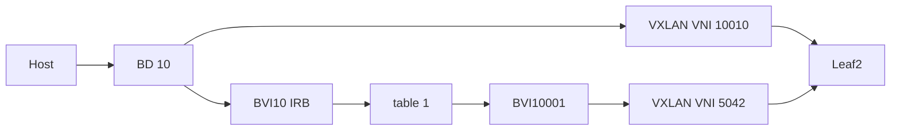

# VPP EVPN plugin

Programs **remote EVPN reachability** into VPP: bridge domains, L2FIB,
neighbors, IP FIB, and refcounted VXLAN tunnels. BGP stays in a userspace
control plane (FRR, BIRD, or a custom agent). That speaker translates Type-2 /
Type-3 / Type-5 into this plugin’s CLI or binary API.

**Version 0.4** — VLAN-based EVPN, symmetric IRB (RFC 7432 + RFC 9135),
FRR-style anycast IRB gateway, and dual-stack / IPv6-unnumbered Type-5
(including RFC 8950-style IPv4-over-IPv6 overlay next hops).

## How it fits on a leaf

| Layer | Who | What |
| --- | --- | --- |
| Control plane | FRR / BIRD in the dataplane netns | Underlay IGP, BGP EVPN, import/export |
| Provisioning | Lab / NMS / `vppctl` | Bridge domains, BVIs, IP tables, access ports, LCP, addresses |
| This plugin | `evpn_plugin.so` | Remote FDB / IMET / Type-5 paths, VXLAN tunnels, gateway MAC protection |

Provision infrastructure first, then **register** it with the plugin
(`evi` / `vrf` / `vtep`). Registration binds to existing objects; the plugin
creates VXLAN and remote FIB/FDB state as routes are installed.

## Datapath

### L2 (Type-2 / Type-3)

One bridge domain per EVI (VLAN). Type-2 installs a static L2FIB entry
`MAC → VXLAN` toward the remote VTEP. Type-3 attaches that tunnel to the BD
flood list (ingress replication). Same `{src, dst, vni}` tunnel is refcounted
across MAC and IMET.

Same-subnet traffic: access → BD → L2FIB → L2 VNI → remote leaf.

### Symmetric IRB (Type-5)

Each tenant VRF has an IP table and an L3-VNI bridge domain
`bd = 10000 + table_id` with its BVI (unique **router MAC** per PE).

Type-5 installs:

1. VXLAN on the L3 VNI into that BD  
2. Static L2FIB `remote-router-MAC → tunnel`  
3. FIB `prefix via <synthetic overlay NH>` out the L3 BVI  
4. Neighbor `<overlay NH> → remote-router-MAC` on that BVI  

Overlay next-hop family:

| Prefix | Default overlay NH |
| --- | --- |
| IPv6 | `fd00:a9fe::xxxx` + ip6 neighbor |
| IPv4 | `169.254.x.y` + ip4 neighbor, **or** `fd00:a9fe::xxxx` when `ipv4-nh-mode` resolves to ipv6 |

`ipv4-nh-mode` on `evpn vrf add` (default **`auto`**):

- `auto` — if the L3 BVI has no IPv4 address, use IPv6 overlay NH for IPv4 prefixes (RFC 8950-style; no `169.254/16`)  
- `ipv4` — always `169.254.x.y` for IPv4 prefixes  
- `ipv6` — always `fd00:a9fe::xxxx` for IPv4 prefixes  

IPv6 prefixes always use `fd00:a9fe::`. Underlay VTEP AFI is independent of overlay NH AFI.

Inter-subnet traffic: host → VLAN IRB BVI → tenant FIB → L3 BVI → L3 VNI → remote PE → destination VLAN BVI.

### Anycast gateway

Shared VIP + MAC on the **VLAN IRB BVI** (optional extra MAC via static
`l2fib add … bvi` or a Linux macvlan on the LCP SVI), same pattern as
[FRR anycast](https://docs.frrouting.org/en/latest/evpn.html).

On IRB registration (and on `evpn learn sync` / learn enable) the plugin
**protects** those MAC/IP identities so a remote Type-2 cannot point the
gateway at VXLAN:

- BVI hardware MAC and addresses  
- Static L2FIB entries whose output is the BVI  
- macvlan children of the LCP peer (parent MAC matches the BVI)  

`show evpn evi` lists the protected set (`bvi`, `l2fib-bvi`, `macvlan`).

Keep the L3 VNI router MAC unique per PE; anycast applies to the VLAN IRB
only.

## Provisioning

Create these before `evpn evi` / `evpn vrf` / `evpn vtep`:

1. **Underlay** — VTEP loopback, IGP reachability to remotes.  
2. **Per VLAN (EVI)** — bridge domain, access ports, optional IRB BVI +
   addresses (anycast VIP/MAC if used).  
3. **Per tenant VRF** — IP table `T` (`ip table add` / `ip6 table add` as needed),
   L3 BD `10000+T`, L3 BVI bound to `T`, `loop{10000+T}` with a **per-PE tenant
   /32** (and/or **/128**), then  
   `set interface unnumbered bvi{10000+T} use loop{10000+T}`.  
   For **IPv6-unnumbered** (no IPv4 on the L3 BVI): put only a `/128` on the
   donor loop, enable IPv6 on the L3 BVI (`set ip6 enable`, `ip6 table`), and
   register with default `ipv4-nh-mode auto` so IPv4 Type-5 uses
   `fd00:a9fe::` instead of `169.254`.  

The L3 BVI has no tenant IP of its own; VPP needs the donor in the same
table. Use a dedicated tenant address on that loopback (e.g. `10.255.0.1/32`),
not the underlay VTEP and not the anycast VIP. ICMP Time Exceeded on the L3
hop sources that donor.

For traceroute / peer source-validation, expose the donor through LCP into
the Linux tenant VRF and let FRR advertise it as Type-5:

```sh
vppctl lcp create loop10001 host-if diag1 netns dataplane
ip -n dataplane link set diag1 master tenant
ip -n dataplane link set diag1 up
```

```text
router bgp 65000 vrf tenant
 address-family ipv4 unicast
  redistribute connected
 exit-address-family
 address-family l2vpn evpn
  advertise ipv4 unicast
 exit-address-family
```

Leave tunnel creation to the plugin: do not pre-create the same
`{local, remote, vni}` VXLAN triples.

## CLI → dataplane

| Command | Effect |
| --- | --- |
| `evpn evi add evi <id> vni <n> bd <id> [irb] [router-mac <mac>]` | Bind EVI to BD (+ BVI if `irb`). Optional `router-mac` must match the BVI. |
| `evpn vrf add table <id> l3-vni <n> [router-mac <mac>] [ipv4-nh-mode auto\|ipv4\|ipv6]` | Bind VRF to table, BD `10000+id`, L3 BVI; lock the IP table(s). Default `ipv4-nh-mode auto`. |
| `evpn vtep add local <ip> remote <ip> [encap-table <id>] [dst_port <n>]` | Underlay endpoints for tunnel create (default UDP **4789**). |
| `evpn mac add evi <id> mac <mac> [ip <addr>] remote <vtep>` | Type-2: VXLAN + L2FIB; optional neighbor on IRB BVI (skipped for local GW). |
| `evpn imet add evi <id> remote <vtep>` | Type-3: VXLAN on BD flood list. |
| `evpn prefix add table <id> <pfx>/<len> remote <vtep> router-mac <mac>` | Type-5: L3 VXLAN + FDB + FIB via synthetic overlay NH. |
| `evpn learn enable\|disable\|sync` | Local learn events + kernel Type-5 import; `sync` forces a one-shot reconcile. |

Matching `… del …` reverses state. Withdraw children before `evi` / `vrf`
delete. Tunnels drop when their refcount hits zero.

```
show evpn [evi|vrf|mac|prefix|tunnel|imet|vtep]
show bridge-domain
show l2fib verbose
show ip fib table <id>
show ip6 fib table <id>
show ip neighbors
show ip6 neighbors
show vxlan tunnel
```

Bring-up order: underlay → tables/BDs/BVIs/access → `evi` / `vrf` / `vtep` →
control plane (or smoke CLI) → `evpn learn enable`.

## Learn

With `evpn learn enable`, learn is **event-driven** (no periodic table scan):

1. **Local Type-2** — VPP L2 MAC add/move/delete events on registered EVI
   bridge-domains (skip static / VXLAN / BVI); notify binary-API clients.  
2. **Local Type-5 candidates** — IPv4/IPv6 address add/del callbacks on IRB /
   L3 BVIs (also refresh anycast GW IP protect for both families).  
3. **Remote Type-5** — long-lived netlink in netns `dataplane` (else process
   netns): BGP/zebra IPv4 and IPv6 route/neigh events for registered VRF
   tables, installed as `evpn prefix add` (`from_kernel`).  
4. **Gateway / macvlan** — netlink link/addr for macvlan children of the LCP
   peer; BVI MAC/IP from `evi add` and address callbacks.  

A full reconcile dump (L2FIB + kernel routes/neigh + GW refresh) runs only on
`learn enable`, `evpn learn sync`, or netlink overrun (`ENOBUFS`).

Clients subscribe with `want_evpn_learn_events`.

## Logging

Class `evpn`. Raise to debug with:

```
evpn logging level debug
```

Gateway decisions use a `gw` prefix (`log | grep gw`):

```
gw evi 10 protect mac 02:00:ca:fe:00:ff src bvi sw_if 5
gw evi 10 ignore mac-add mac 02:00:ca:fe:00:ff remote 10.0.0.2 reason local-gw
```

## Example wiring

Leaf1 VTEP `10.0.0.1`, leaf2 `10.0.0.2`, VLAN 10 / VNI `10010` / BD 10,
tenant table 1, L3 VNI `5042` / BD 10001 (see [`test/smoke.cli`](test/smoke.cli)).



- Same subnet: L2FIB → VNI 10010  
- Other subnet: FIB via `169.254.x.y` → BVI10001 → remote router MAC → VNI 5042  

## Layout

```
evpn.h / evpn.c       object pools, tunnels, gateway protection
evpn_cli.c            debug CLI
evpn.api / evpn_api.c binary API + learn events
evpn_learn.c          L2 MAC events, address callbacks, netlink Type-5/macvlan
evpn_plugin.c         VLIB_PLUGIN_REGISTER
test/                 smoke.cli, registration / multivtep / anycast scripts
Dockerfile            VPP image + plugin + bird3 + FRR
```

## Build

**Docker (recommended):**

```bash
docker build -t ghcr.io/exergy-connect/vpp-with-evpn-plugin .
docker build -t ghcr.io/exergy-connect/vpp-with-evpn-plugin \
  --build-arg VPP_VERSION=25.06-release .
docker pull ghcr.io/exergy-connect/vpp-with-evpn-plugin:latest
```

CI builds on `main` / `v*` tags and pushes to GHCR. The image enables
`evpn_plugin.so` and includes bird3 + FRR. Smoke CLI:
`/usr/share/vpp/evpn-smoke.cli`.

**Out-of-tree against `vpp-dev`:**

```bash
cmake -B build -DVPP_EXTERNAL_PROJECT=ON -DVPP_INSTALL_PATH=/usr
cmake --build build && sudo cmake --install build
```

```
plugins {
  plugin evpn_plugin.so { enable }
  plugin vxlan_plugin.so { enable }
}
```

## Tests

Use a fresh disposable VPP container with the rebuilt `.so` loaded:

```bash
python3 test/registration.py CONTAINER   # registration / withdraw guards
python3 test/multivtep.py CONTAINER      # Type-5 multi-VTEP / overlay NH
python3 test/anycast.py CONTAINER        # gateway MAC/IP stay local
```

Expected smoke wiring: [`test/README.md`](test/README.md).
